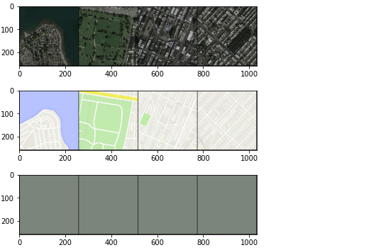
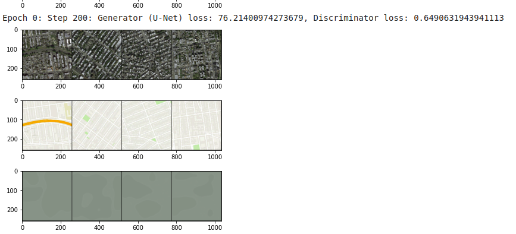

# Sat2Map
A GAN converting satellite images to Map images

This project uses Generative Adversarial Networks a newly emerging field in Deep Learning.This project converts a Satellite image to Map image. Pix2Pix GAN is used in the project, this can be considered as a Supervised Learning method as it is a Paired Image to Image translation which is trained on a dataset of satellite images and target map images.

## Training Results

### Epoch 0 Step 0

### Epoch 1 Step 600

### Epoch 9 Step 5000

### Epoch 10 Step 5600

### Epoch 19 Step 10600

### Epoch 19 Step 10800

Note : This Result is when the GAN is trained for only 20 Epochs 
